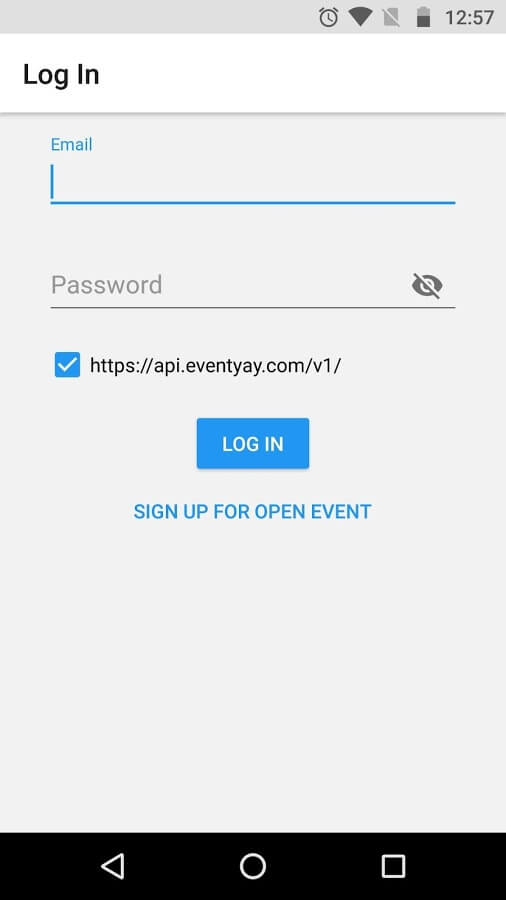
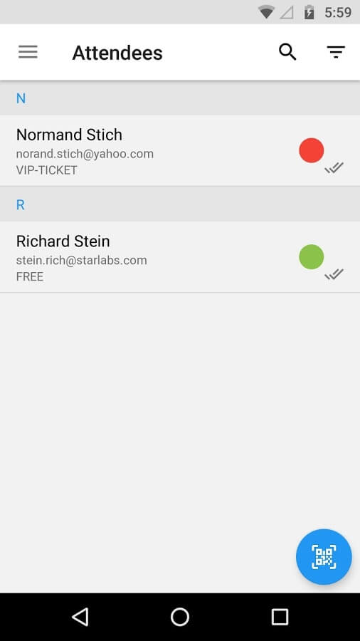
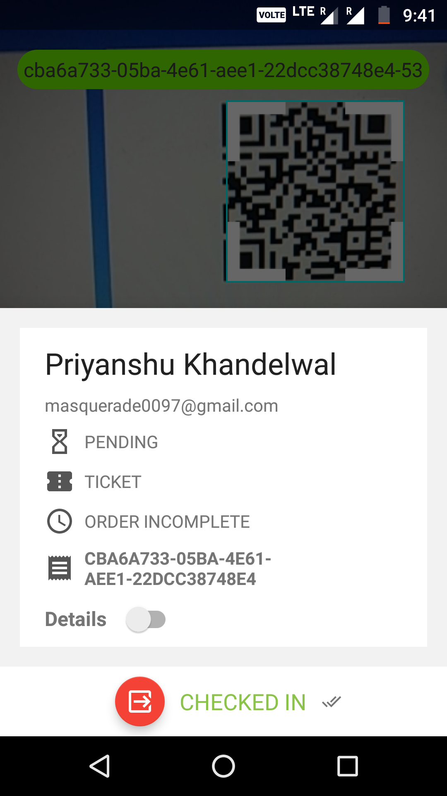
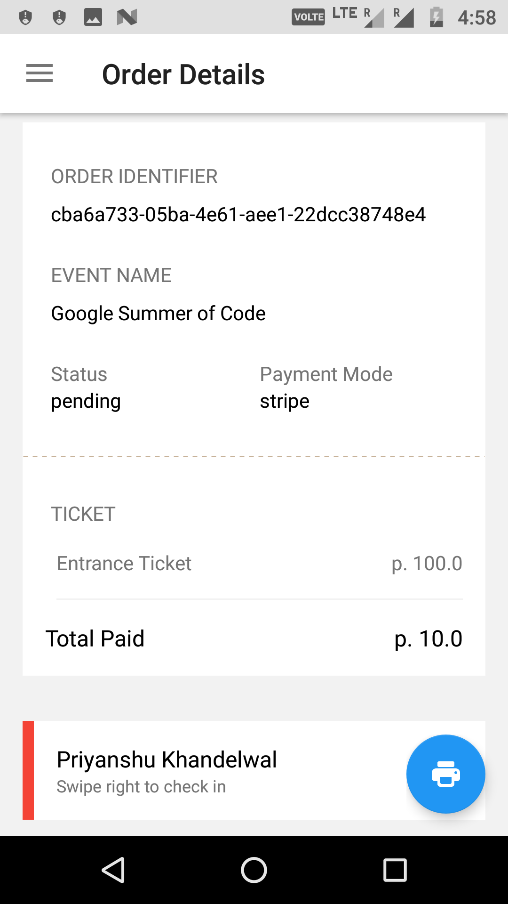
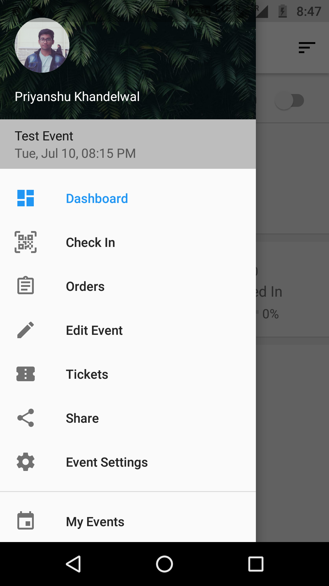

## Open Event Organizer App

> Event management app for organizers using Open Event Platform

The core features of this Android Application are
- Scan a QR code
- Check-in attendees 
- Overview of sales 
- Ticket Management
- Data sync with the [Open Event Organizer Server](https://github.com/fossasia/open-event-orga-server/)

Currently, the application is released in alpha phase and available here:
[Google Play](https://play.google.com/store/apps/details?id=com.eventyay.organizer) and [F-Droid](https://f-droid.org/en/packages/com.eventyay.organizer/).

## Roadmap

Planned features & enhancements are:
- Overview of tracks and sessions
- Quick session re-scheduling
- Push notifications for certain triggers

## Communication

Please join our mailing list to discuss questions regarding the project: https://groups.google.com/forum/#!forum/open-event

Our chat channel is on gitter here: https://gitter.im/fossasia/open-event-orga-app

## Screenshots

<table>
  <tr>
    <td></td>
    <td></td>
    <td></td>
  </tr>
    <tr>
    <td></td>
    <td></td>
    <td></td>
  </tr>
  <tr>
    <td></td>
    <td></td>
    <td></td>
  </tr>
</table>

## Development

- The [Open Event Organizer Server](https://github.com/fossasia/open-event-orga-server) acts as the backend for this application. The API docs for the same can be accessed at https://open-event-api.herokuapp.com/ .
- The following account can be used for testing and development purposes.

Email: orga.developer@gmail.com

Password: fossasia

## Publishing

Each push to master branch automatically publishes the application to Play Store as an Alpha Release. Thus, on each merge into master, the `versionCode` and `versionName` **MUST** be changed accordingly in `app/build.gradle`  
- `versionCode` : Integer : To be monotonically incremented with each merge. Failure to do so will lead to publishing error, and thus is a crucial step before any merge
- `versionName` : String : User visible version of the app. To be changed following [symantic versioning](http://semver.org/)

### Libraries:
- [RxJava 2](https://github.com/ReactiveX/RxJava)
- [Dagger 2](https://github.com/google/dagger)
- [ThreeTenABP](https://github.com/JakeWharton/ThreeTenABP)
- [Jackson](https://github.com/FasterXML/jackson)
- [jsonapi-converter](https://github.com/jasminb/jsonapi-converter)
- [ButterKnife](https://github.com/JakeWharton/butterknife)
- [Lombok](https://projectlombok.org/)
- [Glide](https://github.com/bumptech/glide)
- [Retrofit](https://github.com/square/retrofit) + [OkHttp](https://github.com/square/okhttp)
- [DBFlow](https://github.com/Raizlabs/DBFlow)
- [FastAdapter](https://github.com/mikepenz/FastAdapter)
- [MPAndroidChart](https://github.com/PhilJay/MPAndroidChart)
- [Leakcanary](https://github.com/square/leakcanary)
- [Stetho](https://github.com/facebook/stetho)
- [Sentry](https://github.com/getsentry/sentry-java)
- [Timber](https://github.com/JakeWharton/timber)
- Static Analysis:
  - [android-check](https://github.com/noveogroup/android-check) - Contains checkstyle, PMD and findbugs
- Testing:
  - [JUnit4](https://github.com/junit-team/junit4)
  - [Mockito](https://github.com/mockito/mockito)
  - [RoboElectric](https://github.com/robolectric/robolectric)

### Android Development Setup

Please find info about the set up of the App in your development environment [here](docs/android-dev-setup.md).

### Project Conventions

There is certain conventions we follow in the project, we recommend that you become familiar with these so that the development process is uniform for everyone:

#### Dependency Injection

We use Dagger 2 for DI, so please take a look at how it works. We did not create very complex graphs, component or scopes to keep it simple and easy to refactor. But, we do have certain guidelines as to what needs to be injected and how. Every object which is configurable or there is a possibility for it to be shared among objects, instances or lifecycles in future, must be injected through DI. The interface implementations which have obvious constructions are `@Bind`ed to their concrete classes and a general rule of thumb we follow is to have only one `new` keyword in the injectable construction (the `@Provides` method in Dagger). Meaning that all other dependencies that need to be instantiated during its creation must be passed as arguments and provided by the DI itself.

#### MVP

The project follows Model-View-Presenter design pattern and requires schematic interfaces for each component to be written first as contracts and then implemented.   
All the interactions are done using interfaces only and concrete classes are only used when being injected into required positions. This means any model, view or presenter will only be referenced by its interface. We do so it is easy to mock and test them and there is no discrepancy in the callable methods of the concrete class and the interface.  
We realize that MVP is opinionated and there is no strict boundary between the responsibility of each component, but we recommend following this style:
- `View` is passive and dumb, there is no logic to be exercised in View, only the ability to show data provided by the presenter through contract is present in the View. This makes it easy to unit test and remove the dependence on Android APIs, thus making the need of instrumentation tests scarce
- `Presenter` is responsible for most of the business logic, manipulation of data and organising it for the view to present. All logic for the app is present here and it is devoid of ANY Android related code, making it 100% unit testable. We have created wrapper around common Android APIs in form of models so that they can be mocked and presenter stays clean. The responsibility of presenter includes the fetching of data from external source, observing changes and providing the view with the latest data. It also needs to handle all View interactions that require any logic, such as UI triggers causing complex interactions. Notable exception for this is launching of an Activity on click of a button. There is no logic required in the action and is completely dependent on Android APIs. Lastly, presenter should always clean up after the view is detached to prevent memory leaks
- `Model` has the responsibility to hold the data, load it intelligently from appropriate source, be it disk or network, monitor the changes and notify presenter about those, be self sufficient; meaning to update data accordingly as needed without any external trigger (saving the data in disk after updating from network and providing the saved data from next time on), but be configurable (presenter may be able to ask for fresh data from network). The presenter should not worry about the data loading and syncing conditions (like network connectivity, failed update, scheduling jobs, etc) as it is the job of model itself.

#### Project Structure

Generally, projects are created using package by layer approach where packages are names by layers like `ui`, `activity`, `fragment`, etc but it quickly becomes unscalable in large projects where large number of unrelated classes are crammed in one layer and it becomes difficult to navigate through them.  
Instead, we follow package by feature, which at the cost of flatness of our project, provides us packages of isolated functioning related classes which are likely to be a complete self sufficient component of the application. Each package all related classes of view, presenter, their implementations like Activities anf Fragments.  
A notable exception to this is the `common` module and data classes like Models and Repositories as they are used in a cross component way.  
***Note:** The interface contract for Presenter and View is present in `contract` package in each module`*

#### Unit Testing

We have tight and almost complete coverage of unit tests for models and presenters and it was possible because we have focused on adding conditional unit tests with each functionality we have added. Each functionality was tested under various conditions making the tests self documenting about the functionality of app and saved us from various regressions that are caused after rapid development and refactoring of the application. Because we require the developer to write unit tests along with the code, we build up the confidence and credibility of the code base and remove the lag between functionality and test, making it hard for bugs to creep in between that period. Furthermore, if we let PRs merge without addition of unit tests, and the author of PR does not choose to write tests for it, it becomes difficult for someone else to just write tests for someone else's code and brings the coverage down and may cause regressions in future. We and everyone else wants to focus on creating the app better than to keep solving bugs and writing tests as we write code is the only solution.  
So, please take a look at already written tests(they are fairly self-documenting) and try to write tests for each functionality you add.

#### Separation of concerns

Lastly, each class should only perform one task, do it well, and be unit tested for it. For example, if a presenter is doing more than it should, i.e., parsing dates or implementing search logic, better move it in its own class. There can be exceptions for this practice, but if the functionality can be generalised and reused, it should most definitely be transferred in its own class and unit tested.

### PR Guidelines

Please help us follow the best practice to make it easy for the reviewer as well as the contributor. We want to focus on the code quality more than on managing pull request ethics.

 * Single commit per pull request
 * For writing commit messages please read the [COMMITSTYLE](docs/commitStyle.md) carefully. Kindly adhere to the guidelines.
 * Follow uniform design practices. The design language must be consistent throughout the app.
 * The pull request will not get merged until and unless the commits are squashed. In case there are multiple commits on the PR, the commit author needs to squash them and not the maintainers cherrypicking and merging squashes.
 * If the PR is related to any front end change, please attach relevant screenshots in the pull request description.
 
 Follow [Github Flow](https://help.github.com/articles/github-flow/) for collaboration.

## License

This project is currently licensed under the GNU General Public License v3. A copy of LICENSE.md should be present along with the source code. To obtain the software under a different license, please contact [FOSSASIA](http://blog.fossasia.org/contact/).

